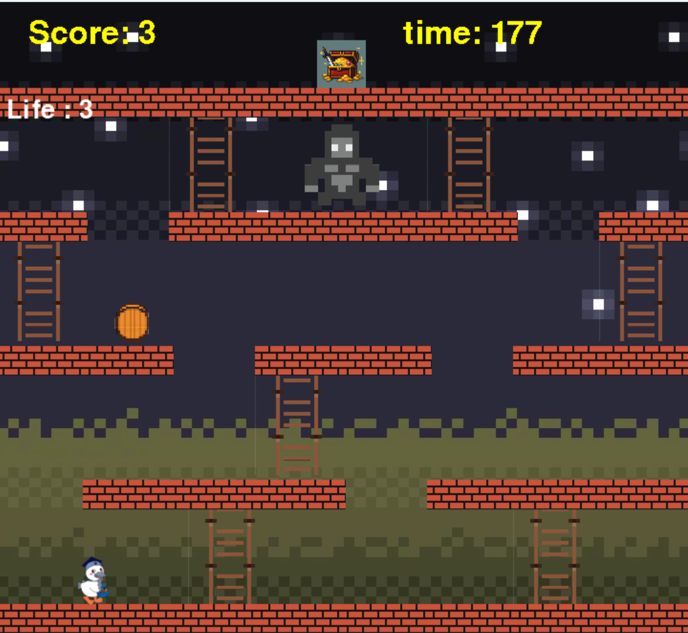

# MonkeyFight

## 概要

MonkeyFightは、Pythonのpygameを使用して制作した2Dアクションゲームです。

プレイヤーはキャラクターを操作し、ステージ内の梯子を使って上へ進み、ゴールである宝を目指します。
敵キャラクターが投げる樽を避けながら、全3ステージのクリアを目指します。

---

## 制作目的

Pythonでのゲーム制作を通して、pygameを利用した画面描画、キャラクター制御、当たり判定、ゲームシステムの実装について学ぶことを目的として制作しました。

---

## 使用技術

- Python 3.13.2
- pygame 2.6.1

---

## 実装した機能

### 基本ゲーム機能

- プレイヤーキャラクターの移動
- ジャンプ機能
- 梯子による上下移動
- ステージ制（全3ステージ）
- 宝を取得するとステージクリア

### 敵・障害物

- 敵キャラクター（ゴリラ）の配置
- 樽による攻撃
- 樽の移動処理
- 足場による樽の落下処理
- 樽との接触判定

### ゲームシステム

- 制限時間
- スコア計算
- ライフ制
- ダメージによるライフ減少
- ゲームオーバー処理
- ステージクリア画面
- 最終結果画面
- 各ステージのスコア保存
- 合計スコア表示

---

# 操作方法

| キー | 操作 |
|---|---|
| ← | 左移動 |
| → | 右移動 |
| ↑ | 梯子を登る |
| SPACE | ジャンプ |

---

# ゲームルール

1. プレイヤーを操作してステージ上部の宝を目指します。
2. ゴリラが投げる樽に当たるとライフが減少します。
3. ライフが0になるとゲームオーバーになります。
4. 宝を取得するとステージクリアになります。
5. 全3ステージをクリアすると最終結果画面が表示されます。

---

# スコア計算

スコアは以下の要素から計算されます。

- ステージクリアボーナス
- 残りライフによるボーナス
- プレイ時間による加算

各ステージのスコアは保存され、最後に合計スコアとして表示されます。

---

# 起動方法

## 必要な環境

以下の環境で動作確認しています。

- Python 3.13.2
- pygame 2.6.1

---

## pygameのインストール

ターミナルまたはコマンドプロンプトで以下を実行してください。

```bash
pip install pygame
```

---

## ゲームの起動

リポジトリをダウンロード後、プロジェクトフォルダへ移動します。

```bash
cd MonkeyFight
```

以下のコマンドでゲームを起動できます。

```bash
python main.py
```

---

# ファイル構成

```
MonkeyFight/
│
├── main.py              # ゲームのメイン処理
├── scene.py             # タイトル画面、ゲーム画面、クリア画面などの管理
├── constants.py         # 画面サイズやゲーム設定
├── enemy.py             # 敵キャラクター処理
├── ui.py                # スコア、ライフ、タイマー表示
├── utils.py             # ゲーム終了処理
│
├── fig/
│   ├── 背景画像
│   ├── キャラクター画像
│   ├── 樽画像
│   └── 宝画像
│
└── README.md
```

---

# 工夫した点

## クラスによる管理

プレイヤー、敵、樽、足場などのゲームオブジェクトをクラスとして管理し、それぞれの役割を分けました。

処理を分割することで、コードの管理をしやすくし、新しい機能を追加しやすい構成にしました。

---

## 当たり判定の実装

pygameのRectを利用して、プレイヤー、敵、樽、足場などの位置を管理しました。

矩形同士の衝突判定を利用することで、敵との接触や足場への着地処理を実装しました。

---

## ステージシステム

ステージごとに足場や梯子の配置を変更し、複数のステージを攻略するゲーム構成にしました。

また、ライフやスコアを実装することで、プレイヤーが繰り返し挑戦できるゲーム性を意識しました。

---

## ゲーム画面の管理

タイトル画面、ゲーム画面、クリア画面、ゲームオーバー画面を分けて管理しました。

画面ごとに処理を分離することで、ゲーム全体の流れを管理しやすくしました。

---

# 今後の改善案

- BGMや効果音の追加
- 敵キャラクターの種類追加
- ステージ数の増加
- キャラクターアニメーションの追加
- 難易度調整
- アイテムやギミックの追加

---

# 制作者

壹岐 拓海

## 作品情報

作品名：MonkeyFight

使用言語：Python

使用ライブラリ：pygame